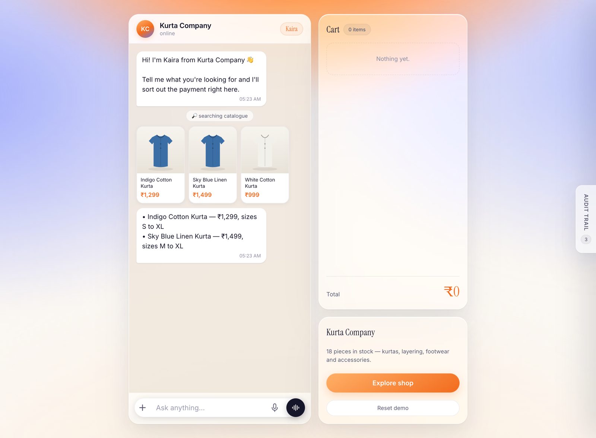
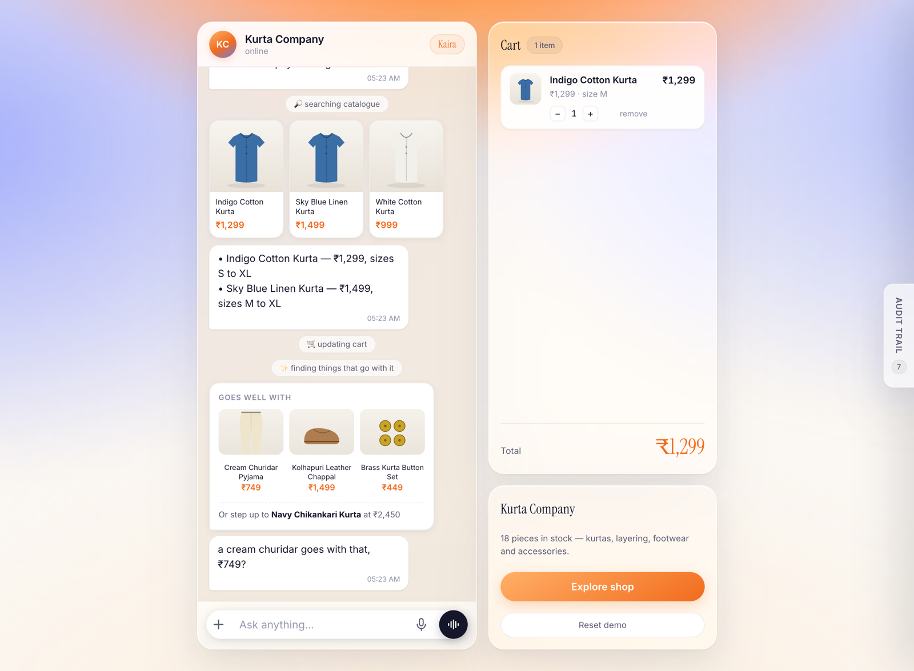
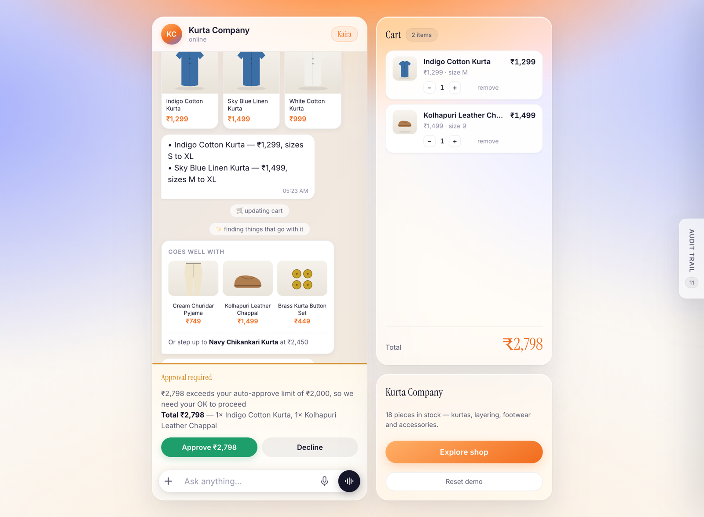
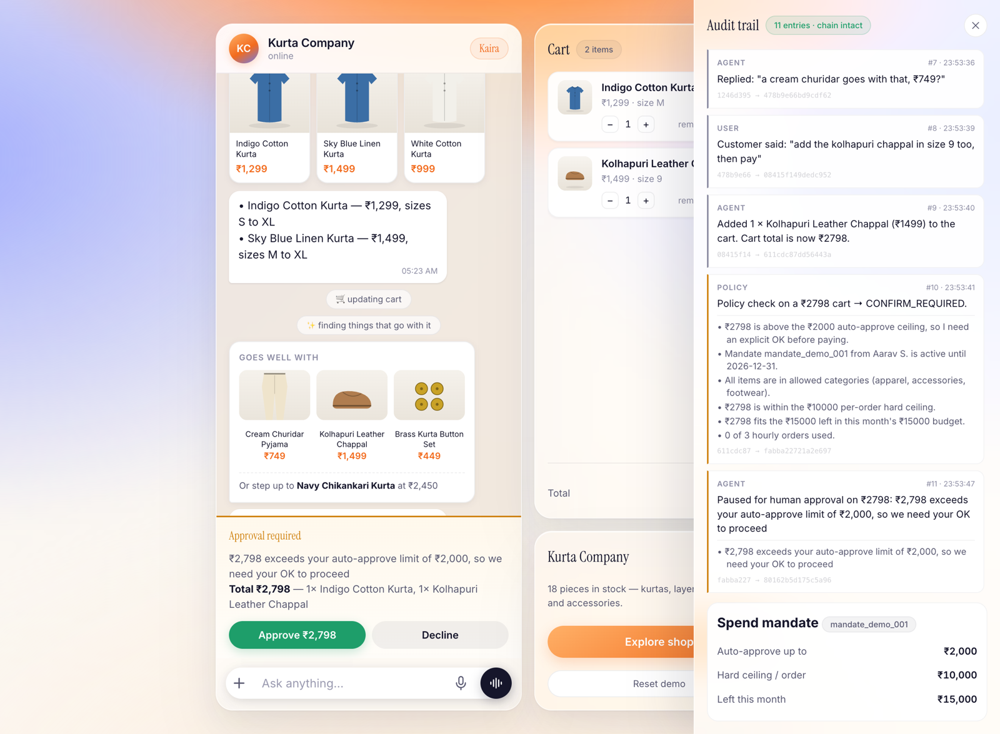
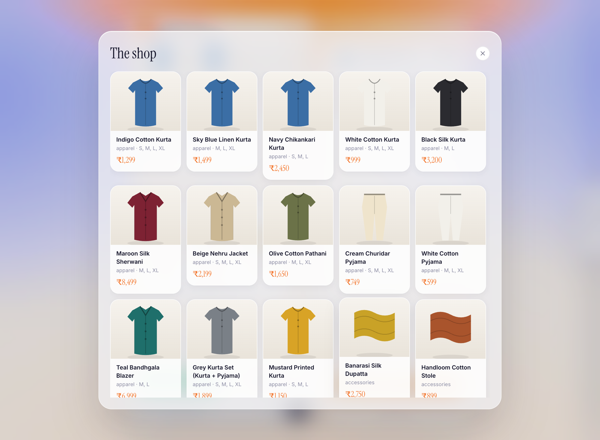
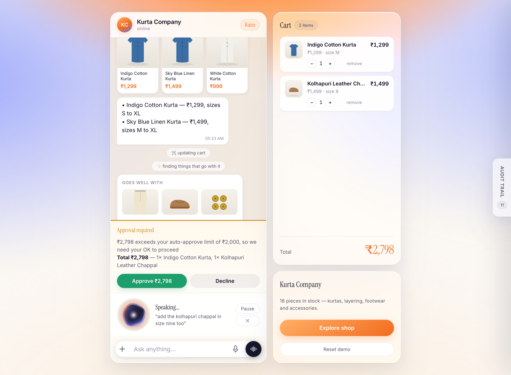

# Kaira

**A conversational checkout agent that can spend your money — safely.**

Built for the Razorpay AI Buildathon, Track 01 · Runs on Razorpay **test mode** only.


<sub>**Kaira searches the merchant's real catalogue and answers in the chat.** Product cards are rendered from the tool's own results, never from the model's prose — so the picture and the price are always the catalogue's.</sub>

---

## The idea

Anyone can wire an LLM to a payment link. The hard part is letting an agent spend **someone else's** money.

So a customer grants a **spend mandate** — a standing, bounded authority:

> *Spend up to ₹2,000 per order without asking. Never more than ₹10,000 in one go, or ₹15,000 a month. Apparel, accessories and footwear only. Three orders an hour.*

Every money action is checked against that mandate by a pure function **before any Razorpay call**, and every decision is written to a hash-chained log in plain English.

The mandate is not a line in a prompt. It is code the model cannot argue with.

---

## Track 01 — where each requirement lives

| The bar | Where |
|---|---|
| **Explainable** | `policy.js` returns plain-English reasons; the agent relays them verbatim |
| **Bounded** | Hard ceilings, monthly cap, category allow-list, velocity limit — enforced in code |
| **Gated** | Above the ceiling the agent stops; a single-use token bound to one exact cart unlocks payment |
| **Visible audit trail** | SHA-256 hash chain, tamper-evident, in-app and at `GET /api/audit` |
| **One failure handled gracefully** | A real Razorpay decline → apology, human explanation, retry. Never claims false success |

**Both halves of the brief**

| | |
|---|---|
| *Grow the merchant's revenue* | Cross-sell and upsell drawn from real catalogue stock |
| *Make them sellable to AI buyers* | An MCP server and a discovery manifest, so an outside agent transacts under the same mandate |

**Three of the four example directions**

| | |
|---|---|
| **Conversational in-app checkout** | Search, cart and payment inside the chat, on Razorpay Orders and Standard Checkout |
| **Upsell & cross-sell agent** | `suggest_addons` reads pairings from the catalogue, so the agent cannot invent a product to sell |
| **Agent-readable catalog** | `/.well-known/agent-manifest.json` and `/api/agent/catalog` publish the products, the tool schemas and the spend limits |

---

## What it looks like


<sub>**Cross-sell and upsell, from real inventory.** `suggest_addons` reads pairings from the catalogue, so the agent can never invent a product to sell. It offers at most two, in one line, and drops it the moment you decline.</sub>


<sub>**The gate. This is the whole project in one screenshot.** ₹2,798 crosses the ₹2,000 auto-approve ceiling, so the agent stops, names the limit it crossed, and waits. Nothing is charged until a human taps Approve.</sub>


<sub>**The evidence.** Every action, with the reasoning behind it and the hash linking it to the one before. Editing any earlier entry breaks the chain and the header says so. Collapsed by default — it is the merchant's evidence, not the shopper's furniture.</sub>


<sub>**Explore shop.** The full catalogue behind a glass overlay, for browsing outside the conversation.</sub>


<sub>**Voice mode.** Hands-free turn taking with a live transcript. The orb is driven by real audio — your microphone while you speak, the synthesised reply while Kaira does.</sub>

---

## Run it

Needs **Node 20 or newer**.

```bash
npm install
cp .env.example .env          # add your keys
npm run smoke                 # 1. proves the Razorpay key works
npm run smoke:llm             # 2. proves the model provider works
npm run dev                   # http://localhost:4123

npm run mcp                   # optional: expose the shop to other AI agents
npm run smoke:voice           # optional: checks the voice providers
```

Run both preflights before anything else — each probes one half of the stack and names the exact field that failed rather than returning a bare `400`.

**Test payment:** card `4111 1111 1111 1111`, any future expiry, any CVV.
**To see the failure case:** pay by UPI with `failure@razorpay`, which Razorpay declines for real.

| Key | Needed for |
|---|---|
| `RAZORPAY_KEY_ID` / `_SECRET` | Required. Test keys only — the app refuses to boot on a live key |
| `ANTHROPIC_API_KEY` *or* `OPENROUTER_API_KEY` | Required. The agent |
| `GROQ_API_KEY` | Optional. Automatic failover when the primary is rate-limited |
| `FISH_AUDIO_API_KEY` | Optional. Voice replies. Without it the app is typing-only |

---

## Architecture

```
Browser ──POST /api/chat──▶ agent.js ──▶ llm.js ──▶ Anthropic / OpenRouter
   ▲                            │                     └─ failover ─▶ Groq
   │ SSE: text, tools, audit    │ every tool call
   │                            ▼
   │                        tools.js ──▶ policy.js   THE GATE
   │                            │        allow │ confirm_required │ deny
   │                            ▼
   │                       razorpay.js ──▶ Orders · Payment Links · Checkout
   │                            │
   └────────────────────── audit.js  SHA-256 hash chain

MCP client (Claude Desktop) ──▶ mcp-server.js ──▶ /api/agent/tools/* ──┘
                                                  same tools, same gate
```

| File | Does |
|---|---|
| `src/policy.js` | The gate. Six rules, one pure function |
| `src/audit.js` | Append-only hash chain |
| `src/tools.js` | Catalogue, cart, policy, approval, checkout, cross-sell |
| `src/llm.js` | Model transport with automatic failover and translation |
| `src/mcp-server.js` | The merchant, exposed to any MCP agent |
| `src/voice.js` | Fish Audio TTS, Deepgram STT, browser STT |

---

## Three things that make it hold up

**The gate cannot be talked past.** `create_payment_link` and `/api/create-order` re-evaluate the policy themselves and derive the amount from the server-held cart. The browser never supplies a price. A jailbroken model, an injected product description, and a crafted HTTP request all hit the same wall.

**Approval is bound to one exact cart.** The token records the total *and* the item set. Change the cart afterwards and the approval is void, the pending order is dropped and any live payment link is cancelled at Razorpay — so a shopper cannot approve ₹1,299 and quietly have ₹9,798 charged.

**The money path does not depend on the model.** Once a human approves, the checkout is created server-side. A rate-limited or failed model turn cannot strand a customer who has already said yes.

---

## Talking to it

Tap the waveform button and the conversation goes hands-free: speak, and Kaira answers out loud. It records until it hears about a second of silence, sends, speaks the reply, then reopens the mic on its own.

Both directions run on a free tier, chosen per direction rather than per vendor:

| | Runs on | Why this one |
|---|---|---|
| **Speech → text** | The browser's own Web Speech API | Free, no upload, and it streams **interim text** so the caption fills in as you speak |
| **Text → speech** | **Fish Audio** `s2.1-pro-free` | Genuinely free under fair use, with a warm Indian-English voice |
| Fallback speech → text | Deepgram `nova-3` | For Safari and Firefox, which have no Web Speech API |

Fish Audio's own ASR is wired up but not the default: its speech-to-text bills against a separate API-credit balance the free tier doesn't include, while its TTS runs free. Splitting the two is what makes voice cost nothing to run.

**The transcript lands in the input box before anything is sent.** That matters more here than in an ordinary voice assistant — this agent spends money on what it hears, so a misheard order has to be visible while it is still a sentence and not yet a purchase. Every spoken turn is also written to the audit trail as a `voice_input` entry, so a voice order is exactly as reviewable as a typed one.

Voice changes how the shopper talks. It changes nothing about what the agent may do: a spoken request passes through the same spend mandate as a typed one.

### The orb

`public/blob.js` is a dependency-free canvas renderer. Its radius, surface motion and rim brightness are driven by a live audio level read through a Web Audio `AnalyserNode` — **your microphone while you speak, the synthesised reply while Kaira does** — so one object animates both halves of the conversation. It shifts palette between listening, thinking and speaking.

Synthesis takes a few seconds for a long reply, which would be dead air, so `/api/voice/speak` is two steps: a `POST` starts synthesis and returns an id, and an `<audio>` element streams `GET /api/voice/speak/:id`. Playback begins on the first bytes rather than the last — **audio starts in about 0.3s regardless of how long the reply is.**

Set `FISH_AUDIO_API_KEY` to enable replies; without it the mic still works and the orb still reacts, because none of that needs a server.

## Transactable by an outside AI buyer

The chat UI is only one buyer. The same merchant is exposed over MCP, so any agent can browse, build a cart and pay — under the same mandate.

```bash
npm run dev      # storefront
npm run mcp      # MCP server over stdio
```

```json
{
  "mcpServers": {
    "kurta-company": {
      "command": "node",
      "args": ["/absolute/path/to/src/mcp-server.js"],
      "env": { "KAIRA_URL": "http://localhost:4123" }
    }
  }
}
```

Discovery lives at `GET /.well-known/agent-manifest.json` — merchant, tool schemas, audit scheme, and **the spend limits published up front**, so a buying agent knows the ceiling before it builds a cart it will not be allowed to pay for.

`mcp-server.js` is a thin client over the storefront's own agent API, not a second implementation. The gate cannot drift, and state is shared — the browser updates live while an external agent shops, and its calls land in the same hash chain tagged `external_invoke`.

**Two buyers, one merchant, one audit trail.**

---

## Deliberate limits

- One in-memory session. This demonstrates a mechanism, not a product.
- The mandate lives in `policy.js`. In production it would be a signed, revocable credential issued at grant time.
- Payment is confirmed by polling and by verified redirect, so the demo needs no public tunnel. `verifyPaymentLinkSignature` shows the path a webhook build would use.
- The catalogue is a static JSON file standing in for a merchant's product feed.
- Screenshots are regenerated with `node scripts/screenshots.mjs` against the running app.
